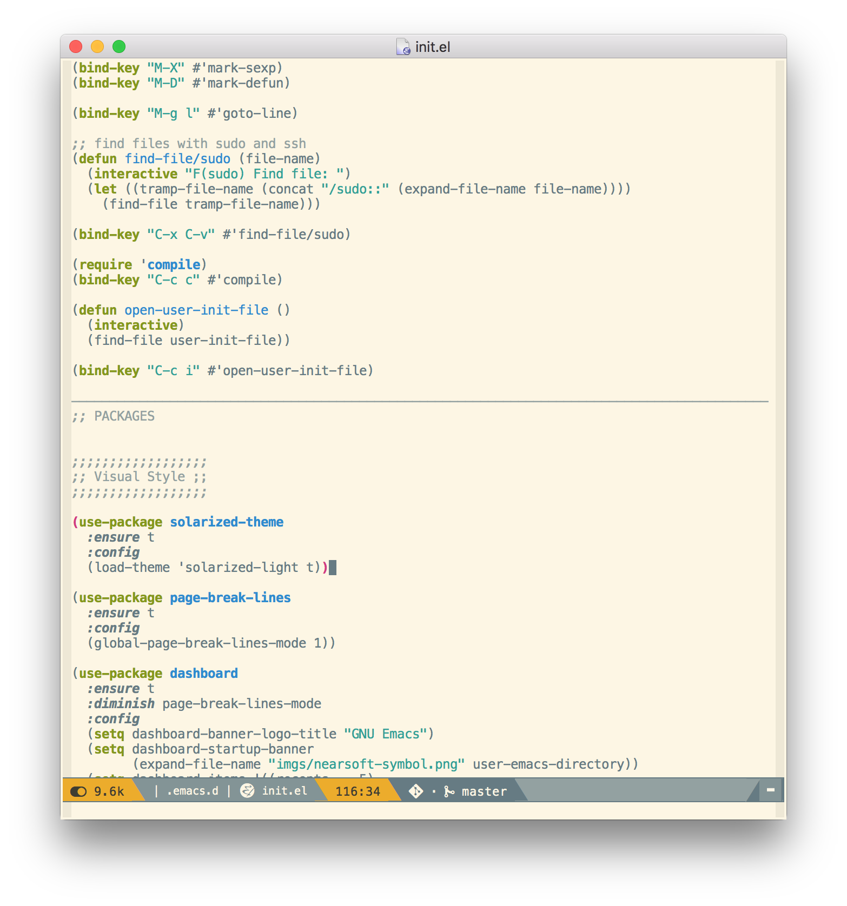

# Emacs config for work

This is my Emacs configuration for writing code at Nearsoft.

## Supported Emacs versions

This config should run on Emacs 25 or greater.

## Installation

To install, clone this repo to `~/.emacs.d`.

## Updates

Update the config code with `git pull` and update the third-party packages with:

<kbd>M-x package-list-packages</kbd>, then <kbd>U</kbd> followed by <kbd>x</kbd>.

## Screenshots

